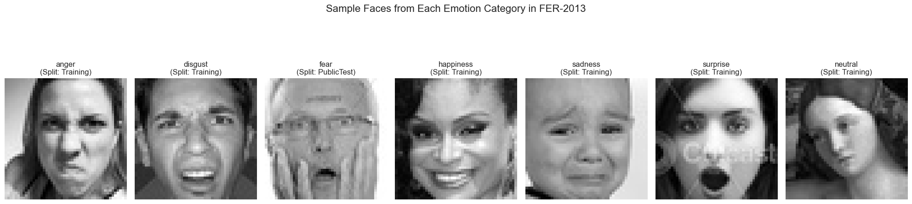
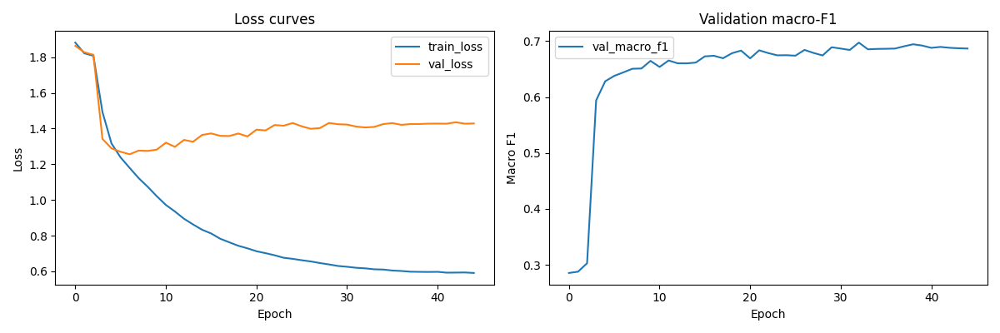
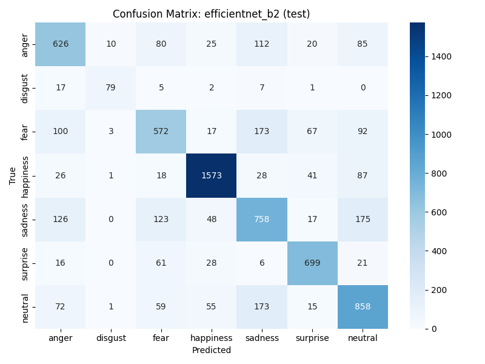
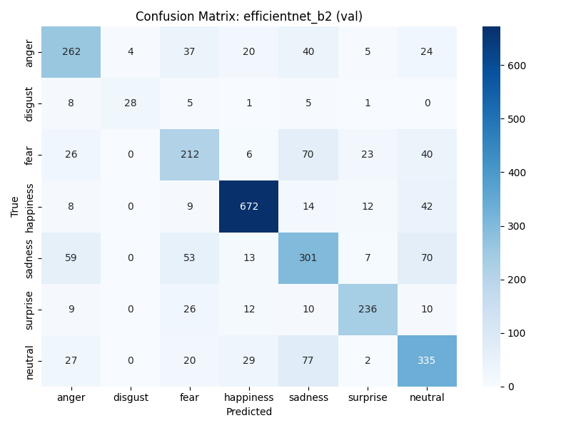
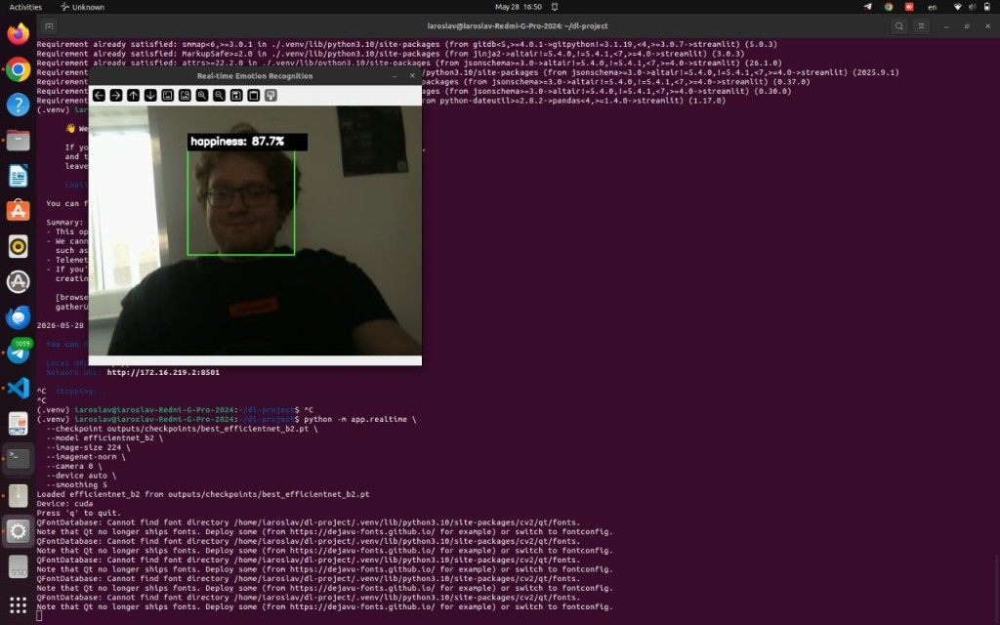
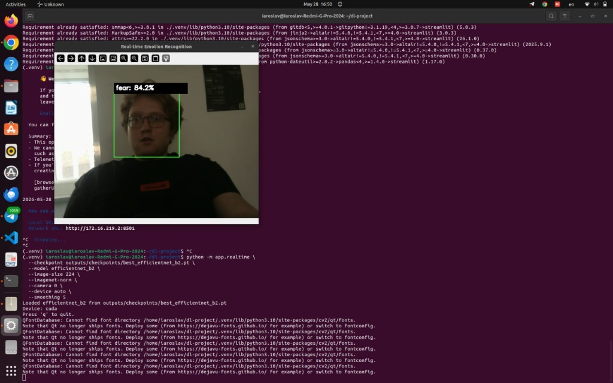

# Deep Emotion Recognition — Project Report

**Course project:** Facial expression classification on FER-2013  
**Final model:** EfficientNet-B2 (ImageNet transfer learning)  
**Repository:** `dl-project`  
**Team:** Iaroslav Kolomiets, Elizaveta Kamenskaya, Petr Kovalev, Dmitrii Plotnikov

---

## 1. Motivation

Recognizing facial expressions from images is a core building block of **affective computing**: systems that infer emotional state from visual cues. Applications include human–robot interaction, accessibility tools, driver monitoring, and lightweight UX analytics. The FER-2013 benchmark provides a standardized, challenging setting: **seven basic emotions** from **low-resolution 48×48 grayscale** crops, with strong **class imbalance** (e.g. disgust is ~16× rarer than happiness).

Our goal was to build a reproducible PyTorch pipeline—from data validation through training, evaluation, and deployment—and to **progressively improve macro-F1** beyond simple CNN baselines, ending with a model suitable for **interactive demo and real-time webcam inference**.

---

## 2. Dataset and Preprocessing

### 2.1 Source and format

| Item | Detail |
|------|--------|
| Dataset | [FER-2013](https://www.kaggle.com/datasets/msambare/fer2013) (`msambare/fer2013`) |
| Local path | `data/raw/fer2013.csv` |
| Schema | `emotion` (0–6), `pixels` (2304 values), `Usage` |
| Total valid rows | 35,887 |
| SHA256 | `fdcc8d89b81b1ec994a23d8e283df7fdd6df8e04492b58f121ea0dda173dc803` |

Folder-based Kaggle data were converted once with:

```bash
python -m src.data.convert_folders_to_csv --raw-dir data/raw --out data/raw/fer2013.csv
```

**Split policy:** `Training` uses the train folder; `PrivateTest` uses the test folder. **Validation** (`PublicTest`) is a **10% hold-out from train** (seed 42, `random_state=42`), not the original Kaggle competition public split. This keeps a fixed validation set for checkpoint selection while using the Kaggle `test/` folder as the held-out test set.

### 2.2 Split and class distribution

| Split | Usage column | Samples |
|-------|--------------|--------:|
| Train | `Training` | 25,839 |
| Validation | `PublicTest` | 2,870 |
| Test | `PrivateTest` | 7,178 |

| Emotion | Train+val+test count | Share (approx.) |
|---------|---------------------:|:---------------:|
| anger | 4,953 | 13.8% |
| disgust | 547 | 1.5% |
| fear | 5,121 | 14.3% |
| happiness | 8,989 | 25.0% |
| sadness | 6,077 | 16.9% |
| surprise | 4,002 | 11.2% |
| neutral | 6,198 | 17.3% |

Pixel statistics (grayscale): mean **129.38**, std **65.08**.

**Why macro-F1:** Accuracy is dominated by frequent classes (happiness). We select checkpoints and compare models by **validation macro-F1**, then report test metrics once for the chosen model.

### 2.3 Preprocessing pipeline

Implemented in `src/data/dataset.py` and `src/data/transforms.py`:

- Parse `pixels` → 48×48 tensor, scale to [0, 1].
- **Baseline models:** 48×48, single channel, normalize with mean=0.5, std=0.5.
- **EfficientNet-B2:** resize to **224×224**, replicate to 3 channels, **ImageNet** mean/std.
- **Train-only augmentation:** horizontal flip, rotation (±12°), affine jitter, optional **ColorJitter** (brightness/contrast) and **RandomErasing** (`--strong-aug`).
- Validation/test: deterministic resize + normalize only.

Data readiness is validated with:

```bash
python -m src.data.prepare_data --csv data/raw/fer2013.csv --out data/processed/dataset_stats.json
```

---

## 3. Exploratory Data Analysis

EDA was performed in `dataset_analysis.ipynb` on the full CSV (`35,887` rows × 3 columns: `emotion`, `pixels`, `Usage`). Figures below are saved under `docs/figures/`.

### 3.1 Dataset overview

After loading `data/raw/fer2013.csv`, every row has a valid 48×48 grayscale face encoded as 2,304 space-separated pixel values in `[0, 255]`.

| Column | Description |
|--------|-------------|
| `emotion` | Integer label 0–6 |
| `pixels` | Flattened 48×48 grayscale |
| `Usage` | `Training`, `PublicTest`, or `PrivateTest` |

### 3.2 Split sizes

| Usage | Role | Samples |
|-------|------|--------:|
| `Training` | Train | 25,839 |
| `PublicTest` | Validation (10% of train folder) | 2,870 |
| `PrivateTest` | Test (Kaggle test folder) | 7,178 |

### 3.3 Global class distribution

Counts over the **full dataset** (all splits combined):

| Emotion | Count | Share |
|---------|------:|------:|
| happiness | 8,989 | 25.05% |
| neutral | 6,198 | 17.27% |
| sadness | 6,077 | 16.93% |
| fear | 5,121 | 14.27% |
| anger | 4,953 | 13.80% |
| surprise | 4,002 | 11.15% |
| disgust | 547 | 1.52% |

**Imbalance ratio:** happiness has **~16.4×** more samples than disgust. Accuracy alone would reward predicting happiness; we therefore use **macro-F1** and **sqrt class weights** in training.


### 3.4 Class distribution per split

The relative class proportions are **similar across train, validation, and test**, so split leakage from imbalance is unlikely—the main issue is global rarity of disgust and the difficulty of negative-valence classes.


### 3.5 Sample faces (48×48)

One random example per class (seed 42) illustrates typical FER-2013 quality: centered or off-center faces, varying contrast, and low spatial detail at native resolution.



**Visual observations:**

- **Happiness** often shows a clear smile; easiest class for both humans and models.
- **Surprise** tends to have raised brows / wide eyes; distinct from happiness.
- **Disgust** samples are few and sometimes subtle—high variance for the classifier.
- **Fear, sadness, neutral, anger** can look similar at 48×48 (subtle mouth and brow changes), matching later confusion-matrix errors.

### 3.6 EDA conclusions → modeling choices

| EDA finding | Training response |
|-------------|-------------------|
| Severe class imbalance (disgust 1.5%) | `--class-weights sqrt` in `src/train.py` |
| Noisy / ambiguous labels | `--label-smoothing 0.1` |
| Small crops, pose variation | `--strong-aug` (flip, rotation, affine, RandomErasing, brightness/contrast jitter) |
| Low native resolution | Upscale to **224×224**, ImageNet norm, EfficientNet-B2 pretraining |

Reproduce EDA: open and run `dataset_analysis.ipynb` (requires `data/raw/fer2013.csv`).

---

## 4. Methods

We implemented four model families behind a single factory (`src/models/__init__.py` → `create_model()`).

### 4.1 Baseline CNN

Three conv blocks (32→64→128 channels), batch norm, max pooling, MLP head with dropout. Trained from scratch at **48×48** without ImageNet weights. Serves as a simple, fully custom baseline.

### 4.2 SE-CNN

Same backbone as the baseline with **Squeeze-and-Excitation** blocks (`src/models/se_block.py`, `src/models/se_cnn.py`) to re-weight channel responses. Hypothesis: attention helps on noisy, low-res faces.

### 4.3 ResNet-18 transfer learning

TorchVision `ResNet18_Weights.DEFAULT`, grayscale → 3-channel repeat, replaced final linear for 7 classes (`src/models/resnet18_transfer.py`). Establishes a strong transfer-learning baseline at 48×48 (or configurable size).

### 4.4 EfficientNet-B2 (final model)

ImageNet-pretrained EfficientNet-B2 (`src/models/efficientnet_transfer.py`):

- Grayscale input repeated to 3 channels.
- Custom classifier head: Dropout(0.3) + Linear(7).
- **Two-phase fine-tuning:** backbone frozen for epochs 0–2, full unfreeze from epoch 3 (`--freeze-backbone --unfreeze-epoch 3`).
- Input **224×224**, ImageNet normalization.

**Training recipe (final run):**

| Hyperparameter | Value |
|----------------|-------|
| Optimizer | AdamW |
| Learning rate | 3×10⁻⁴ |
| Weight decay | 10⁻⁴ |
| Scheduler | CosineAnnealingLR (45 epochs) |
| Batch size | 32 |
| Loss | CrossEntropy + **label smoothing 0.1** |
| Class weights | **sqrt** of balanced weights |
| AMP | enabled |
| Gradient clip | 1.0 |
| Selection metric | Validation **macro-F1** |

**Rationale:** Literature and our ResNet-18 results showed transfer learning beats from-scratch CNNs on FER-2013. EfficientNet-B2 offers a better accuracy–efficiency trade-off than ResNet-18. Label smoothing and sqrt class weights mitigate overconfidence and imbalance without over-penalizing majority classes. Freeze-then-unfreeze stabilizes the new head before updating low-level filters.

---

## 5. Work Performed (Pipeline and Engineering)

| Step | What we did | Why |
|------|-------------|-----|
| Data layer | CSV loader, split filtering, transforms, folder→CSV converter | Reproducible FER-2013 ingestion |
| Training | Unified `src/train.py` CLI for all models; checkpoint by val macro-F1; history JSON + curve plots | Fair comparison, traceability |
| Metrics | Accuracy, macro/weighted F1, per-class report, confusion matrices (`src/utils/metrics.py`, `plotting.py`) | Imbalance-aware evaluation |
| Evaluation | `src/evaluate.py` for val/test splits | Standardized reports after training |
| Inference | `src/predict.py` single-image CLI | Quick sanity checks |
| Apps | Streamlit `app/demo.py`, OpenCV `app/realtime.py`, shared `app/inference.py` | Demonstrate deployment beyond offline test set |
| Tests | 19 pytest tests (dataset, models, metrics, smoke train/eval) | Catch regressions in CI/local runs |

**Training commands (representative):**

```bash
# Baseline / SE-CNN
python -m src.train --csv data/raw/fer2013.csv --model baseline_cnn --out outputs --epochs 50 --batch-size 128
python -m src.train --csv data/raw/fer2013.csv --model se_cnn --out outputs --epochs 50 --batch-size 128

# ResNet-18
python -m src.train --csv data/raw/fer2013.csv --model resnet18 --no-freeze-backbone \
  --out outputs --epochs 30 --batch-size 128 --lr 3e-4

# EfficientNet-B2 (final)
python -m src.train --csv data/raw/fer2013.csv --model efficientnet_b2 --weights default \
  --freeze-backbone --unfreeze-epoch 3 --out outputs --epochs 45 --batch-size 32 \
  --lr 3e-4 --weight-decay 1e-4 --image-size 224 --imagenet-norm --strong-aug \
  --label-smoothing 0.1 --class-weights sqrt --optimizer adamw --amp --grad-clip 1.0 --num-workers 4
```

---

## 6. Results

### 6.1 Model comparison (test set, n = 7,178)

| Model | Accuracy | Macro-F1 | Weighted-F1 |
|-------|----------:|---------:|------------:|
| Baseline CNN | 0.592 | 0.488 | 0.581 |
| SE-CNN | 0.603 | 0.533 | 0.599 |
| ResNet-18 | 0.637 | 0.633 | 0.636 |
| **EfficientNet-B2** | **0.7196** | **0.7147** | **0.7192** |

EfficientNet-B2 improves **test macro-F1 by +0.082** absolute over ResNet-18 and **+0.227** over the baseline CNN—confirming that architecture, resolution, and the stronger training recipe matter more than shallow capacity increases alone.

### 6.2 EfficientNet-B2 — validation vs test

| Split | Samples | Accuracy | Macro-F1 | Weighted-F1 |
|-------|--------:|---------:|---------:|------------:|
| Validation | 2,870 | 0.7129 | 0.6972 | 0.7135 |
| Test | 7,178 | 0.7196 | 0.7147 | 0.7192 |

Validation and test metrics are aligned (no large gap), suggesting the hold-out validation split is a reasonable proxy for final performance.

**Best checkpoint:** epoch **32** by validation macro-F1 (**0.6973** in `outputs/history_efficientnet_b2.json`), saved as `outputs/checkpoints/best_efficientnet_b2.pt`.

### 6.3 Per-class performance (EfficientNet-B2, test)

| Emotion | Precision | Recall | F1 | Support |
|---------|----------:|-------:|---:|--------:|
| anger | 0.637 | 0.653 | 0.645 | 958 |
| disgust | 0.840 | 0.712 | 0.771 | 111 |
| fear | 0.623 | 0.559 | 0.589 | 1,024 |
| happiness | 0.900 | 0.887 | **0.893** | 1,774 |
| sadness | 0.603 | 0.608 | 0.605 | 1,247 |
| surprise | 0.813 | 0.841 | **0.827** | 831 |
| neutral | 0.651 | 0.696 | 0.673 | 1,233 |

**Strongest:** happiness, surprise (high precision; happiness rarely confused).  
**Weakest:** fear, sadness (lower recall; mutually confused with each other and neutral).

### 6.4 ResNet-18 per-class F1 (test, reference)

| Emotion | F1 | Notes |
|---------|---:|-------|
| fear | 0.476 | Main bottleneck vs EfficientNet |
| sadness | 0.500 | Often confused with fear/neutral |
| happiness | 0.827 | Already strong |
| surprise | 0.775 | — |

EfficientNet-B2’s largest gain on fear (+0.113 F1) and sadness (+0.105 F1) explains most of the macro-F1 improvement.

### 6.5 Training dynamics (EfficientNet-B2)

Key milestones from `outputs/history_efficientnet_b2.json`:

| Epoch | Event | Val accuracy | Val macro-F1 |
|------:|-------|-------------:|---------------:|
| 0–2 | Backbone frozen | ~0.34–0.37 | ~0.29–0.30 |
| 3 | Backbone unfrozen | 0.638 | 0.594 |
| 9 | — | 0.685 | 0.665 |
| 19 | — | 0.704 | 0.683 |
| **32** | **Best checkpoint** | **0.713** | **0.697** |
| 44 | Last epoch | 0.706 | 0.687 |

After unfreezing (epoch 3), validation macro-F1 rises sharply—pretraining provides useful features once the head has warmed up. Later epochs show mild overfitting on train accuracy (~0.99) while validation plateaus near ~0.71 accuracy / ~0.70 macro-F1.

**Learning curves** (loss, accuracy, macro-F1 vs epoch):



*Saved during training (`outputs/figures/curves_efficientnet_b2.png`). Sharp jump at epoch 3 matches backbone unfreeze.*

### 6.6 Confusion matrices

**Test set** (rows = true label, columns = predicted; order: anger, disgust, fear, happiness, sadness, surprise, neutral):



**Validation split:**



*Produced by `src/evaluate.py`. Numeric test matrix (from `outputs/metrics/classification_report_efficientnet_b2_test.json`):*

| True \\ Pred | anger | disgust | fear | happy | sad | surprise | neutral |
|--------------|------:|--------:|-----:|------:|----:|---------:|--------:|
| anger | **626** | 10 | 80 | 25 | 112 | 20 | 85 |
| disgust | 17 | **79** | 5 | 2 | 7 | 1 | 0 |
| fear | 100 | 3 | **572** | 17 | 173 | 67 | 92 |
| happiness | 26 | 1 | 18 | **1573** | 28 | 41 | 87 |
| sadness | 126 | 0 | 123 | 48 | **758** | 17 | 175 |
| surprise | 16 | 0 | 61 | 28 | 6 | **699** | 21 |
| neutral | 72 | 1 | 59 | 55 | 173 | 15 | **858** |

### 6.7 Error analysis

1. **Fear ↔ sadness ↔ neutral:** Fear misclassifications include 173→sadness, 92→neutral, 100→anger; sadness includes 123→fear and 175→neutral. These pairs share subdued mouth/eyebrow geometry on 48×48 crops.
2. **Anger ↔ sadness/fear:** 112 anger samples called sadness; symmetric confusion in negative valence classes.
3. **Happiness** is the cleanest column (1573/1774 correct); most errors go to neutral or surprise.
4. **Disgust** has high precision (0.84) but moderate recall (0.71)—expected with only 111 test samples.
5. **Domain shift:** Webcam faces (see §7) differ in lighting, pose, and resolution from FER crops; temporal smoothing in the app mitigates label flicker.

---

## 7. Deployment: Demo and Real-Time Recognition

### 7.1 Streamlit dashboard

`streamlit run app/demo.py` — upload an image, select model/checkpoint, view top-k probabilities and bar chart. Defaults point to EfficientNet-B2 at 224px with ImageNet normalization.

### 7.2 Real-time webcam pipeline

```bash
python -m app.realtime \
  --checkpoint outputs/checkpoints/best_efficientnet_b2.pt \
  --model efficientnet_b2 \
  --image-size 224 \
  --imagenet-norm \
  --camera 0 \
  --device auto \
  --smoothing 5
```

Pipeline: OpenCV capture → **Haar frontal-face detector** → crop → same preprocessing as offline inference → EfficientNet-B2 → **moving average over 5 frames** for stable labels. Runs on **CUDA** when available (see terminal logs in screenshots).

### 7.3 Real-time detection examples

The model was tested live on a laptop webcam. Below: bounding box, emotion label, and confidence.

**Happiness (87.7% confidence):**



**Fear (84.2% confidence):**



These examples show the deployment path works end-to-end: face localization, 224px EfficientNet inference, and readable overlays. Expressions with clear facial muscle activation (smile vs widened eyes) are recognized with high confidence; ambiguous poses may still flip between negative classes without smoothing.

---

## 8. Findings and Conclusions

1. **Transfer learning at higher resolution wins on FER-2013.** EfficientNet-B2 at 224px with ImageNet pretraining and a disciplined fine-tuning recipe reaches **~72% test accuracy** and **~0.715 macro-F1**, competitive with published EfficientNet-B2 results on this benchmark (~70–73% accuracy range).

2. **Macro-F1 and class weights are essential** given imbalance; sqrt-weighted loss + label smoothing improved minority-class behavior without collapsing majority-class precision.

3. **Freeze-then-unfreeze is effective:** Most gain appears at epoch 3 when the backbone unfreezes; best val macro-F1 occurs mid-schedule (epoch 32), not the last epoch—early stopping on val macro-F1 is justified.

4. **Remaining errors are structural:** fear/sadness/neutral confusion reflects limited resolution and subjective labels in FER-2013, not only model capacity.

5. **The stack is deployable:** shared inference code powers CLI, Streamlit, and real-time OpenCV demos on GPU.

---

## 9. Limitations and Future Work

| Limitation | Possible direction |
|------------|-------------------|
| 48×48 native FER resolution | Train with face-aligned higher-res crops; MTCNN/RetinaFace alignment |
| Validation split derived from train | Align with official FER splits for strict benchmark comparison |
| Haar cascade on webcam | Modern face detector (MediaPipe, YuNet) for robust crops |
| Seven discrete classes | Continuous affect or compound emotions |
| Single frame | Temporal model (LSTM/Transformer) over video clips |
| Class imbalance | Focal loss, oversampling disgust, ensemble |

---

## 10. Reproducibility

| Artifact | Path |
|----------|------|
| Best weights | `outputs/checkpoints/best_efficientnet_b2.pt` |
| Training history | `outputs/history_efficientnet_b2.json` |
| Val metrics JSON | `outputs/metrics/classification_report_efficientnet_b2_val.json` |
| Test metrics JSON | `outputs/metrics/classification_report_efficientnet_b2_test.json` |
| EDA & report figures | `docs/figures/` (`output.png`, `class distrib train val.png`, `sample.png`, curves, confusion matrices, `realtime/`) |
| Curves (training) | `outputs/figures/curves_efficientnet_b2.png` |
| Confusion matrices (eval) | `outputs/metrics/confusion_matrix_efficientnet_b2_{val,test}.png` |
| Tests | `pytest -q` (19 passed) |

**Evaluate final model:**

```bash
python -m src.evaluate \
  --csv data/raw/fer2013.csv \
  --model efficientnet_b2 \
  --checkpoint outputs/checkpoints/best_efficientnet_b2.pt \
  --split test \
  --out outputs/metrics \
  --image-size 224 \
  --imagenet-norm
```

---

## 11. References

- Goodfellow et al., *Challenges in representation learning: Facial expression recognition challenge* (FER-2013).
- Hu et al., *Squeeze-and-Excitation Networks* (SE blocks).
- Tan & Le, *EfficientNet: Rethinking Model Scaling for Convolutional Neural Networks*.
- Dataset: [Kaggle FER-2013 (msambare)](https://www.kaggle.com/datasets/msambare/fer2013)

---

### Figure index (`docs/figures/`)

| File | Description |
|------|-------------|
| `output.png` | Global class counts (EDA) |
| `class distrib train val.png` | Class counts by train / val / test (EDA) |
| `sample.png` | One random 48×48 face per emotion (EDA) |
| `curves_efficientnet_b2.png` | Train/val loss, accuracy, macro-F1 |
| `confusion_matrix_efficientnet_b2_test.png` | Test confusion matrix |
| `confusion_matrix_efficientnet_b2_val.png` | Validation confusion matrix |
| `realtime/happiness_87.7.png` | Webcam demo — happiness |
| `realtime/fear_84.2.png` | Webcam demo — fear |

---

*Report: repository code, `dataset_analysis.ipynb`, `outputs/` metrics, figures under `docs/figures/`.*
